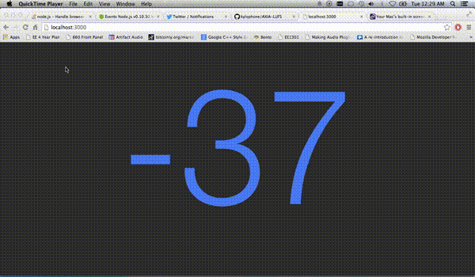

AXIA-LUFS
=========
An EBU R128 loudness meter for Axia Livewire streams with a short-term (3 sec.) and/or momentary (100ms) loudness readouts. 100ms Resolution.

</img>

###What is Axia Livewire?
Axia Livewire is an IP networked audio protocol used in broadcast. Among other things, it allows for 32767 channels of raw multicast PCM audio distributed over a standard IP network. Axia <a href="http://axiaaudio.com/xnodes">nodes</a> are connected to the network and provide audio I/O.
###What does a Livewire audio stream consist of?
Raw PCM (big endian, 24-bit signed, 48000 kHz, stereo interleaved) delivered in the form of multicast IP/UDP/RTP packets.
###How does this work?
Raw PCM is extracted from each packet. PCM converted to 64-bit float, and handed to <a href = "https://github.com/jiixyj/libebur128">libebur128</a> for loudness measurement.
###To Do
Buffer input / confirm packet sequence. (UDP does not guarantee packets arrive in order; xNodes buffer 15-100ms the recieve side.)
###Setup and Use
* Get `libebur128`, and then compile axialufs.c.
